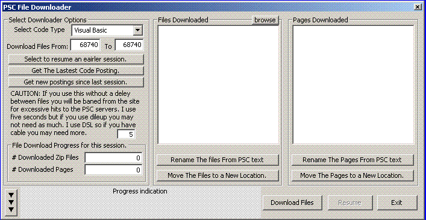



## PSC code downloader

### Description

The renaming zip file code uses the unzip32.dll version 1.1.0.0

Info-ZIP's UnZip DLL for Win32. It also uses web browser control

and the msinet control. It will download every file on the psc servers

but that isn't its' best feature nor is it recomended. It will also list and download

the last 50 files posted to the planet. you can also search psc by author and

download all there files. Although; I have only tested this with vb and c++

it should work with all PSC listings. It saves its' download progress in the registry.

I have updated the downloader with a new option "Download All Results" and added a simple help file.
 
### More Info
 

             |
---                |---
**Submitted On**   |2007-06-06 18:57:30
**By**             |[Russell Sanders](https://github.com/Planet-Source-Code/PSCIndex/blob/master/ByAuthor/russell-sanders.md)
**Level**          |Beginner
**User Rating**    |4.7 (14 globes from 3 users)
**Compatibility**  |VB 6\.0
**Category**       |[Complete Applications](https://github.com/Planet-Source-Code/PSCIndex/blob/master/ByCategory/complete-applications__1-27.md)
**World**          |[Visual Basic](https://github.com/Planet-Source-Code/PSCIndex/blob/master/ByWorld/visual-basic.md)
**Archive File**   |[PSC\_code\_d206951662007\.zip](https://github.com/Planet-Source-Code/russell-sanders-psc-code-downloader__1-68747/archive/master.zip)

